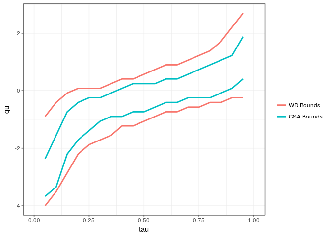

<!-- README.md is generated from README.Rmd. Please edit that file -->
csabounds
=========

The csabounds package allows the user to obtain tight bounds on distributional treatment effect parameters that depend on the joint distribution of treated and untreated potential outcomes -- the joint distribution is not identified under standard identifying assumptions such as selection on observables or even when experimental data is available. Using the package requires three periods of panel data and the results follow under the Copula Stability Assumption. More details about the method can be found in Callaway (2017).

Installation
------------

You can install csabounds from github with:

``` r
# install.packages("devtools")
devtools::install_github("bcallaway11/csabounds")
#> Downloading GitHub repo bcallaway11/csabounds@master
#> from URL https://api.github.com/repos/bcallaway11/csabounds/zipball/master
#> Installing csabounds
#> '/usr/lib/R/bin/R' --no-site-file --no-environ --no-save --no-restore  \
#>   --quiet CMD INSTALL  \
#>   '/tmp/Rtmpk3Zmf1/devtools4be032447b05/bcallaway11-csabounds-9bf8f68'  \
#>   --library='/home/tug82594/R/x86_64-pc-linux-gnu-library/3.4'  \
#>   --install-tests
#> 
```

Example
-------

The following is a simplified example of the heterogeneous effects of job displacement considered in Callaway (2017) using data from the 1979 National Longitudinal Study of Youth.

A subset of the data is contained in the `displacements` dataset contained in the package. `delt.seq` contains a vector of values to compute the distribution of the treatment effect for; that is, \(F_{Y_{1t}-Y_{0t}|D_t=1}(\delta)\). `y.seq` contains possible values for outcomes.

``` r
 library(csabounds)
 data(displacements)
 delt.seq <- seq(-4,4,length.out=50)
 y.seq <- seq(6.5,13,length.out=50)
```

The first step is to compute the counterfactual distribution of untreated potential outcomes for the treated group, \(F_{Y_{0t}|D_t=1}\). In this example, I use the Change in Changes method (Athey and Imbens, 2006) which is available in the `R` `qte` package. The distribution of outcomes for the treated group in periods \(t-1\) and \(t-2\) also needs to be set and is not done automatically using the `qte::CiC` method.

``` r
 cc <- qte::CiC(learn ~ treat,
                t=2011, tmin1=2007, tname="year",
                idname="id", panel=TRUE, data=displacements,
                probs=seq(.05,.95,.01),se=FALSE)
 cc$F.treated.tmin2 <- ecdf(subset(displacements, year==2003 & treat==1)$learn)
 cc$F.treated.tmin1 <- ecdf(subset(displacements, year==2007 & treat==1)$learn)
```

Once the counterfactual distribution is avialable, one can run the main method to compute bounds on the distribution and the quantile of the treatment effect itself. (Recall the quantile of the treatment effect (QoTT) is significantly more challenging than the quantile treatment effect (QTT) because it depends on the distribution of treated and untreated potential outcomes.) Under the Copula Stability Assumption -- see Callaway (2017) -- one can construct significantly tighter bounds on the distribution and quantile of the treatment effect. These are calculated and plotted next.

``` r
 cb <- csa.bounds(learn ~ treat, 2011, 2007, 2003, "year", "id",
         displacements, delt.seq, y.seq, cc,
         method="level", cl=1)
#> [1] "Step 1 of 4: Calculating conditional distribution of treated potential outcomes..."
#> [1] "Step 2 of 4: Calculating conditional distribution of untreated potential outcomes..."
#> [1] "Step 3 of 4: Calculating lower bound"
#> [1] "Step 4 of 4: Calculating upper bound"
 cb
#> $F.l
#> Empirical CDF 
#> Call: NULL
#>  x[1:50] =     -4, -3.8367, -3.6735,  ..., 3.8367,      4
#> 
#> $F.u
#> Empirical CDF 
#> Call: NULL
#>  x[1:50] =     -4, -3.8367, -3.6735,  ..., 3.8367,      4
#> 
#> $F.wd.l
#> Empirical CDF 
#> Call: NULL
#>  x[1:50] =     -4, -3.8367, -3.6735,  ..., 3.8367,      4
#> 
#> $F.wd.u
#> Empirical CDF 
#> Call: NULL
#>  x[1:50] =     -4, -3.8367, -3.6735,  ..., 3.8367,      4
 ggCSABounds(cb, wdbounds=TRUE)
```


